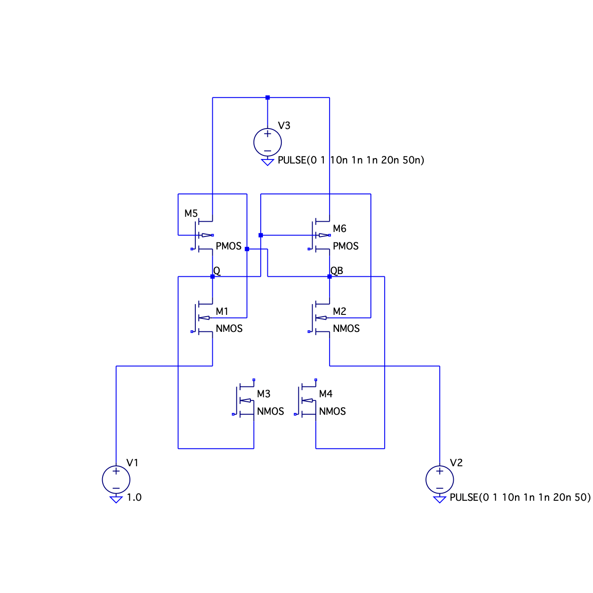
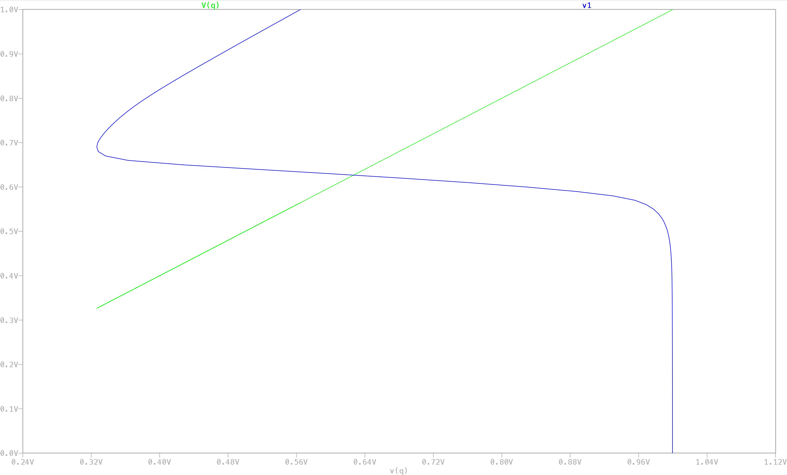
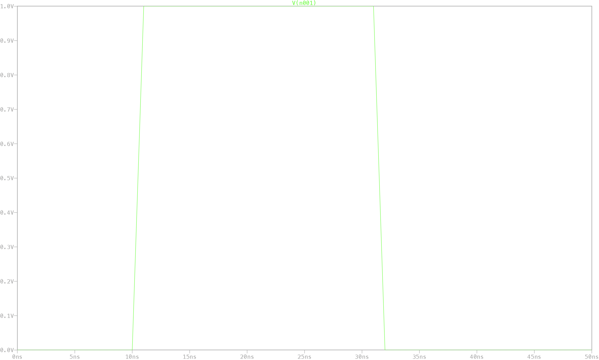
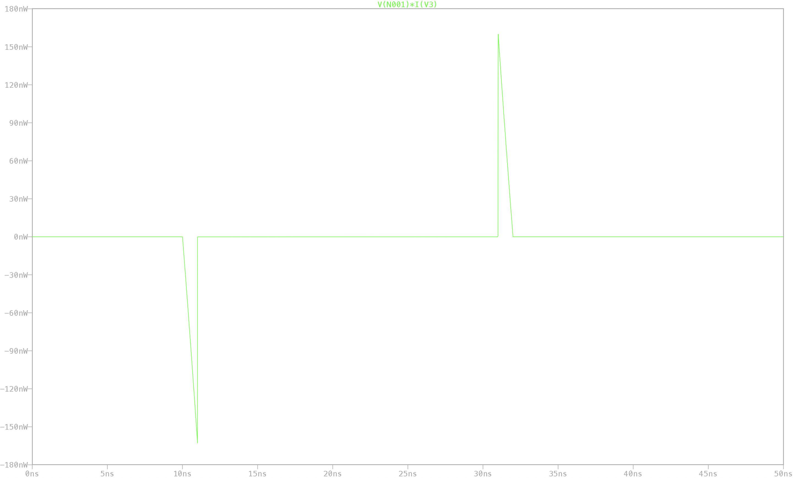

# 6T SRAM Cell — Design & Performance Characterization in 45nm CMOS

A from-scratch design, simulation, and performance characterization of a standard 6-Transistor (6T) SRAM cell, built in LTspice XVII using 45nm Predictive Technology Models (PTM). The goal of this project is to establish a clear performance baseline — stability, write speed, and power consumption — for the conventional 6T topology at the 45nm node, which serves as a reference point for evaluating more advanced low-power SRAM architectures (e.g. 8T cells or sleep-transistor designs).

This repository contains the schematic, the device models, the simulation results, and a full write-up of the methodology and findings.

---

## Table of Contents

- [Background](#background)
- [Circuit Design](#circuit-design)
- [Simulation Setup](#simulation-setup)
- [Results](#results)
  - [Static Noise Margin (Butterfly Curve)](#static-noise-margin-butterfly-curve)
  - [Transient Write Response](#transient-write-response)
  - [Power Consumption](#power-consumption)
- [Summary of Key Metrics](#summary-of-key-metrics)
- [Running the Simulation](#running-the-simulation)
- [Technology Models](#technology-models)
- [Future Work](#future-work)
- [References](#references)
- [Author](#author)
- [License](#license)

---

## Background

Static Random Access Memory (SRAM) is the backbone of on-chip cache memory (L1/L2/L3) in modern processors, valued for its speed advantage over DRAM. However, as CMOS technology scales down to the deep sub-micron and nanometer regime, SRAM design faces growing challenges: increased leakage current, greater sensitivity to process variation, and shrinking noise margins that threaten data retention.

A number of architectural variants have been proposed to address these issues — for example, sleep-transistor techniques that cut off leakage paths during standby. While such modifications can meaningfully reduce power, they typically come at the cost of additional area and control complexity. Before adopting these more elaborate designs, it's useful to have a clean, well-characterized baseline for the *standard* 6T cell, so that any improvements from alternative topologies can be measured against a known reference.

That's the purpose of this project: design a standard 6T SRAM cell at the 45nm node and characterize its stability, write performance, and power behavior using industry-standard predictive models.

---

## Circuit Design

The cell follows the conventional 6-transistor SRAM topology, which is made up of two functional blocks:

**1. Storage element (the latch)**
Two cross-coupled CMOS inverters — formed by transistors M1/M5 and M2/M6 — create a bistable latch. This positive-feedback loop allows the cell to hold a logic state ('0' or '1') indefinitely as long as power is supplied, with the complementary storage nodes labeled **Q** and **QB**.

**2. Access transistors**
In the full 6T cell, two NMOS access transistors (commonly labeled M3/M4) connect the internal storage nodes Q and QB to the bitlines (BL/BLB), gated by the wordline (WL). During a write, the bitlines are driven to complementary values and the wordline is asserted, allowing the new value to overpower the latch's feedback and flip the stored state.

> **Note on this repository's schematic:** The `.asc` file included here implements the core cross-coupled latch (M1, M2, M5, M6) with the DC sweep configuration used to generate the butterfly curve / SNM analysis. If you are extending this project to reproduce the transient write test and power profile shown below, add the M3/M4 access NMOS transistors gated by a wordline pulse, along with bitline drive sources, as described in [Simulation Setup](#simulation-setup).

*Figure 1 — Cross-coupled inverter pair (M1/M5, M2/M6) forming the storage latch, with wordline and bitline drive sources for the write/transient test.*

| Transistor | Type | Role |
|---|---|---|
| M5, M6 | PMOS | Pull-up devices of the cross-coupled inverters |
| M1, M2 | NMOS | Pull-down devices of the cross-coupled inverters |
| M3, M4 | NMOS | Access transistors connecting Q/QB to bitlines |

---

## Simulation Setup

- **Simulator:** LTspice XVII
- **Device models:** 45nm Predictive Technology Models (PTM), Level 54 (BSIM4), for both NMOS and PMOS — see [`models/`](models)
- **Supply voltage (VDD):** 1.0 V
- **Analyses performed:**
  - **DC sweep** of the cross-coupled inverter pair to extract the Voltage Transfer Characteristic (VTC) and construct the butterfly curve for Static Noise Margin (SNM) evaluation.
  - **Transient analysis** of a write operation: the cell is initialized to '0', the bitlines are driven to complementary values, and the wordline is pulsed to flip the stored state to '1'.
  - **Power analysis** by monitoring instantaneous power drawn from the VDD supply (`V(node) * I(Vsource)`) across the simulation window, capturing both static leakage and the dynamic switching transient.

---

## Results

### Static Noise Margin (Butterfly Curve)

Stability is arguably the most important property of an SRAM cell — it determines whether the stored value can survive voltage noise on the storage nodes without flipping unintentionally.

To evaluate this, the VTC of one inverter in the cross-coupled pair is plotted against the *inverse* VTC of the other, producing the characteristic "butterfly" shape. The **Static Noise Margin (SNM)** is defined as the side length of the largest square that can be inscribed inside each lobe ("eye") of the curve.

*Figure 2 — Butterfly curve from the DC sweep. The wide opening of both lobes indicates a healthy noise margin and robust data retention under this 45nm PTM model set.*

A wide-eyed butterfly curve like this indicates the cell can tolerate a reasonable amount of voltage disturbance on Q/QB — important in dense memory arrays where adjacent-cell switching and supply noise can otherwise corrupt stored data.

### Transient Write Response

To verify write functionality, the cell is initialized to store a '0'. A write is then performed by driving the bitline (BL) to VDD and the complementary bitline (BLB) to ground, then asserting the wordline (WL) for a 20 ns window.

*Figure 3 — Storage node voltage during the write operation. The node transitions cleanly from 0 V toward VDD as the wordline pulse is applied, then holds its new state once the wordline is de-asserted.*

**Result:** the storage node successfully flips from 0 V to 1 V (with the complementary node flipping from 1 V to 0 V), confirming the write completes correctly.

**Write access time:** measured as the time for the storage node to transition from 10% to 90% of VDD, the write completes in **approximately 800 ps** — a sub-nanosecond response that is consistent with the kind of switching speed expected for high-frequency cache memory at this node.

This fast, clean transition also indicates that the relative sizing between the access transistors and the pull-up PMOS devices is well-balanced: the access path is strong enough to overcome the latch's feedback and force the new state, without introducing instability.

### Power Consumption

Power was evaluated by tracking the instantaneous power drawn from the VDD supply across the full simulation window.

*Figure 4 — Instantaneous power profile. The flat baseline corresponds to static leakage power during standby; the sharp transient corresponds to the dynamic switching energy consumed during the write operation.*

Two distinct regimes are visible:

- **Static (standby) leakage:** while the cell holds its state with no activity on the wordline, the power draw settles to a baseline of approximately **169.8 nW**. This very low standby figure highlights one of the main advantages of the 45nm node for idle power — a critical consideration for battery-powered or always-on memory arrays that spend most of their time in standby.

- **Dynamic switching:** during the write pulse, a momentary current/power spike appears, corresponding to the energy needed to flip the latch's state. The clear separation between this spike and the static baseline shows that the dynamic switching event is well-isolated and doesn't bleed into the standby power figure.

---

## Summary of Key Metrics

| Metric | Value |
|---|---|
| Supply voltage (VDD) | 1.0 V |
| Static Noise Margin (SNM) | Wide-opening butterfly curve — robust stability |
| Write access time (10%–90% VDD) | ≈ 800 ps |
| Standby (static leakage) power | ≈ 169.8 nW |

---

## Running the Simulation

1. Install [LTspice XVII](https://www.analog.com/en/resources/design-tools-and-calculators/ltspice-simulator.html) (Windows or macOS).
2. Clone this repository and make sure `models/45nm_PTM.lib` is in the same directory as `ltspice/SRAM_Test.asc`, or update the `.include` directive at the top of the schematic to point to the correct relative path (e.g. `.include ../models/45nm_PTM.lib`).
3. Open `SRAM_Test.asc` in LTspice and run the simulation.
4. In the waveform viewer:
   - Plot the DC sweep output to reproduce the **butterfly curve** (Figure 2)
   - For a transient write test, plot `V(Q)` / `V(QB)` against the wordline pulse (Figure 3)
   - For the power profile, plot `V(node) * I(Vsource)` for the VDD supply (Figure 4)

---

## Technology Models

The NMOS and PMOS device models are 45nm-node **Predictive Technology Models (PTM)**, specified as Level 54 (BSIM4) SPICE models. PTM models are widely used in academic and early-stage design exploration because they capture short-channel effects and parasitic behavior representative of real nanometer-scale devices without requiring access to a foundry's proprietary PDK.

---

## Future Work

Potential directions for extending this baseline characterization:

- Add the M3/M4 access transistors and full read/write testbench (bitlines + wordline driver) directly into the shared schematic.
- Sweep transistor sizing (W/L ratios) to study SNM vs. write-margin trade-offs.
- Characterize **read access time** and **read disturb margin**, in addition to write performance.
- Compare against alternative topologies (8T, 9T, sleep-transistor 6T) using the same PTM model set for a like-for-like comparison.
- Run Monte Carlo / process-variation analysis to assess robustness across mismatch and PVT corners.

---

## References

- W. Zhao and Y. Cao, "New generation of Predictive Technology Model for sub-45 nm early design exploration," *IEEE Transactions on Electron Devices*, vol. 53, no. 11, pp. 2816–2823, Nov. 2006.
- E. Seevinck, F. J. List, and J. Lohstroh, "Static-noise margin analysis of MOS SRAM cells," *IEEE Journal of Solid-State Circuits*, vol. 22, no. 5, pp. 748–754, Oct. 1987.
- N. Mahendran, M. Harshini, S. Arthi, K. Bhavadharani, and R. Booma, “Development of Low Power Energy Efficient 32nm SRAM Utilizing Sleep Transistor Technology,” in 2024 10th International Conference on Advanced Computing and Communication Systems (ICACCS), Coimbatore, India, 2024, pp. 1001-1006.
- S. A. Tawfik and V. Kursun, “Low power and high speed SRAM design with dual dynamic node hybrid logic,” in 2010 International Conference on Computer Engineering & Systems, Cairo, Egypt, 2010, pp. 315-320.
- B. S. R. Reddy, S. Chandrasekhar and M. Kamaraju, “Design of low power and high speed 6T SRAM cell using 45nm technology,” in 2012 International Conference on Computing, Electronics and Electrical Technologies (ICCEET), Kumaracoil, India, 2012, pp. 912-915.
- P. K. Pal, B. K. Bhattacharyya and A. K. Dandapat, “Low power 6T SRAM cell design using 45nm technology,” in 2014 International Conference on Information Communication and Embedded Systems (ICICES), Chennai, India, 2014, pp. 1-5.
  
---

## Author

**Rachit Saini**
Department of Electrical & Instrumentation Engineering, Thapar Institute of Engineering & Technology.

---

## License

This project is licensed under the [MIT License](LICENSE).
